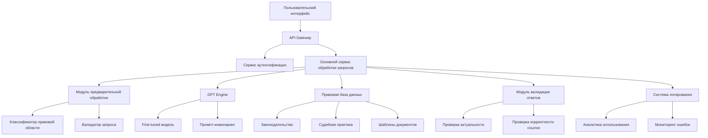

### 3. Структура нейро-сотрудника

**Общая схема системы**:  
Диаграмму можно создать с помощью Mermaid и показать структуру системы.

```mermaid
graph TD
A[Пользовательский интерфейс] --> B[API Gateway]
B --> C[Сервис аутентификации]
B --> D[Основной сервис обработки запросов]
D --> E[Модуль предварительной обработки]
E --> F[Классификатор правовой области]
E --> G[Валидатор запроса]
D --> H[GPT Engine]
H --> I[Fine-tuned модель]
H --> J[Промпт-инжиниринг]
D --> K[Правовая база данных]
K --> L[Законодательство]
K --> M[Судебная практика]
K --> N[Шаблоны документов]
D --> O[Модуль валидации ответов]
O --> P[Проверка актуальности]
O --> Q[Проверка корректности ссылок]
D --> R[Система логирования]
R --> S[Аналитика использования]
R --> T[Мониторинг ошибок]
```
