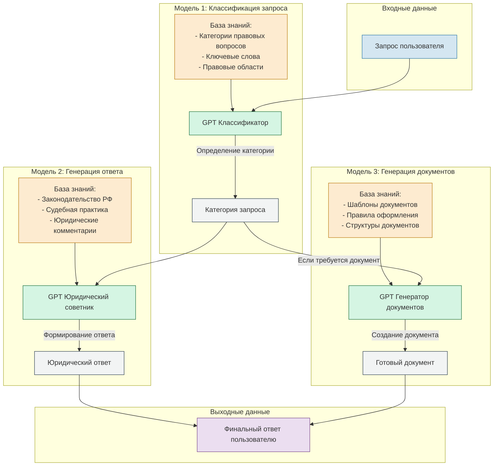

Понял вашу задачу. Создам новую схему, которая будет отображать именно работу нейро-сотрудника и взаимодействие трёх моделей GPT.

Данная схема показывает:

1. **Модель 1 (Классификатор)**:
   - Получает исходный запрос пользователя
   - Использует базу знаний категорий и ключевых слов
   - Определяет категорию запроса и тип требуемого ответа
   - Направляет запрос к соответствующей модели

2. **Модель 2 (Юридический советник)**:
   - Получает классифицированный запрос
   - Обращается к базе знаний законодательства и судебной практики
   - Генерирует юридически обоснованный ответ

3. **Модель 3 (Генератор документов)**:
   - Активируется, если требуется создание документа
   - Использует базу шаблонов и правил оформления
   - Создает готовый документ по шаблону

Каждая модель:
- Имеет свою специализированную базу знаний
- Работает с конкретным типом задач
- Передает результат следующему этапу

Для четвертого этапа потребуется:
1. Сделать скриншоты работы каждой модели
2. Показать примеры:
   - Классификации запроса
   - Генерации юридического ответа с ссылками на законодательство
   - Создания документа на основе шаблона
3. Продемонстрировать взаимодействие моделей между собой
